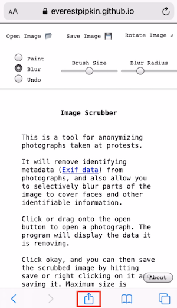
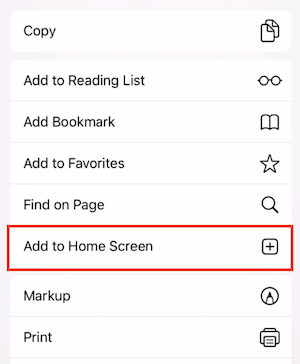
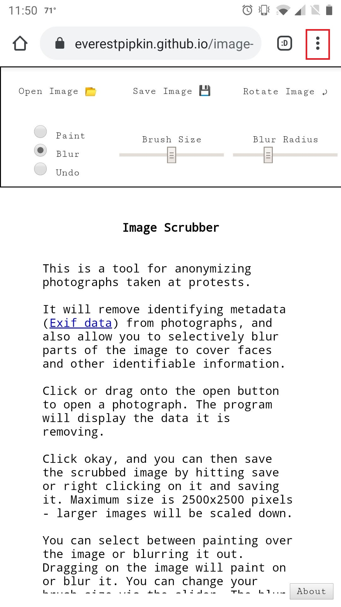
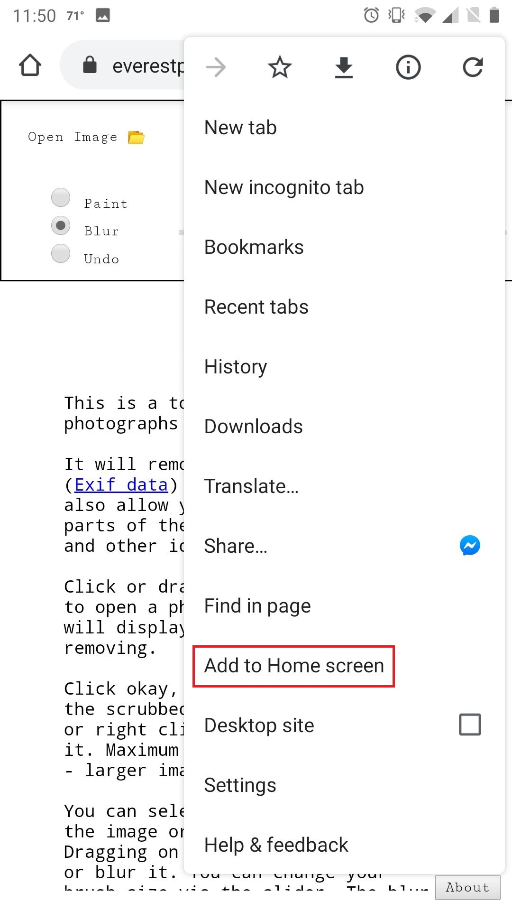

# image-scrubber
This is a tool for anonymizing photographs taken at protests. 

Tool lives at : https://everestpipkin.github.io/image-scrubber/ 

It will remove identifying metadata (Exif data) from photographs, and also allow you to selectively blur parts of the image to cover faces and other identifiable information. 

## Installation

You can use the tool [here](https://everestpipkin.github.io/image-scrubber/). 

You can also install the tool as a mobile app.

* **iOS:**
    * Go to the link above in Safari and tap the Share button.\
    
    * Tap the "Add to Home Screen" button.\
    
* **Android:**
	* Open the Chrome menu with the three dots in the top right.\
	
	* Tap the "Add to Home screen" button.\
	

## How to Use

Hit the open button to open a photograph. The program will display the data it is removing. 

Click okay, and you can then save the scrubbed image by hitting save or right clicking on it and saving it. Maximum size is 2500x2500 pixels - larger images will be scaled down.

You can select between painting over the image or blurring it out. Dragging on the image will paint on or blur it. You can change your brush size via the slider. The blur function has built-in pixel shuffling/noise and is fairly secure but sensitive information should be covered with the paint tool.

**All processing happens directly in the browser- no information is stored or sent anywhere.** 

The website works without an internet connection, and it's more secure to use this resource offline. There are two ways to do this: 

1. Turn on airplane mode after loading the page and before opening images - This way, no third-party services (like a browser extension or insecure wireless network) can transmit the images you upload. (Recommended for mobile)

2. [Download](https://github.com/everestpipkin/image-scrubber/archive/main.zip) the tool from Github, and open index.html locally: This is the safest, but takes a little more effort and is harder to do on mobile.  By clicking the link, you will download a zip file containing all the files necessary to run this on your own system.  Extract, or unzip, the folder, and open the index.html file with a web browser of your choice, and use it using the instructions above.  Just to be safe, still turn off data/internet before opening any photos with the tool.

If you're a command-line whiz with git set up, you can clone this repository instead of downloading the zip.  The command to do so: 

    git clone https://github.com/everestpipkin/image-scrubber

---

Bits of code all though this lifted and adapted from various jsfiddles and libraries --

Thank you:

* http://jsfiddle.net/sierawski/4xezb7nL/
* https://stackoverflow.com/questions/22604903/needed-canvas-blurring-tool
* http://jsfiddle.net/m1erickson/baDLp/
* https://storage.flother.is/etc/2010/examples/canvas-blur/v3/canvas-image.js
* http://quasimondo.com/StackBlurForCanvas/StackBlur.js
* https://github.com/exif-js/exif-js
* http://jsfiddle.net/4cwpLvae/
* https://stackoverflow.com/questions/16645801/rotate-canvas-90-degrees-clockwise-and-update-width-height
* https://stackoverflow.com/questions/19129644/how-to-pixelate-an-image-with-canvas-and-javascript
* https://devbutze.blogspot.com/2014/02/html5-canvas-offscreen-rendering.html
* And to everyone who has contributed to this repository or filed a bug report.

My code is still a bit of a mess but utility over cleanliness, will continue to fix up in the coming days after the more critical work is over.

## Tech notes

See [this doc](tech-notes.md) for tech notes.
